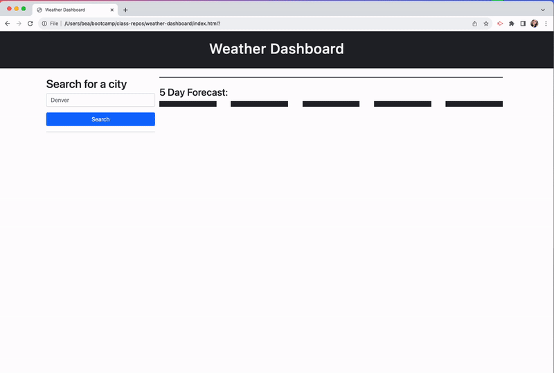

# Weather-dashboard

## Description

This repo was created for travellers looking for multiple cities' weather to plan a trip accordingly

## Installation

N/A

deployed site: https://beabravo.github.io/weather-dashboard/

## Usage

1. Start by typing the name of city you're interested in
2. Press enter or hit the 'search' button
3. current and 5 day forecast will show and a list item will be added to the history
4. Repeat steps 1-3 for as many cities as you would like
5. if you would like to go back to a previously looked at city, hit the button on the list with the name of the city
6. Have fun planning your trip!

## Credits

N/A

## License

Please refer to the license in repo
